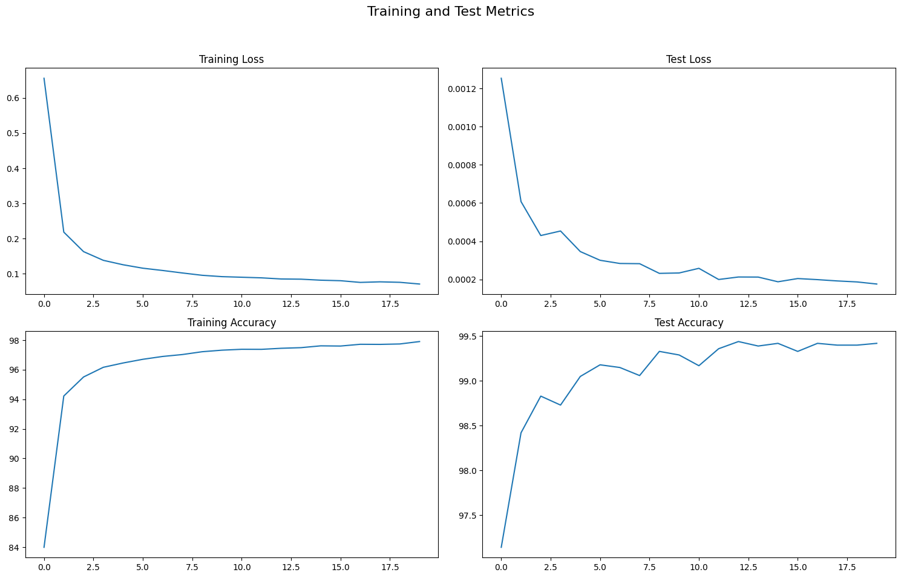

# MNIST based model that achieves 99.4% accuracy with less than 20k Parameters

Using CNN, MNIST based model was made with 99.4% validation/test accuracy and less than 20k Parameters .

    It involved using - 
        Data Augmentation
        Batch Normalization
        Dropouts
        Max Pooling
        1X1 Convolution
        Global Average Pooling

I will be explaining the key points and sharing the learnings

## Data Augmentation
I have used this augmentation for final run .

    # Custom Cutout transform
    class RandomCutout(object):
        def __init__(self, mask_size, p=0.5):
            self.mask_size = mask_size
            self.p = p

        def __call__(self, img):
            if random.random() > self.p:
                return img

            w, h = img.size
            mask_size_half = self.mask_size // 2

            cx = random.randint(mask_size_half, w - mask_size_half)
            cy = random.randint(mask_size_half, h - mask_size_half)

            x1 = cx - mask_size_half
            y1 = cy - mask_size_half
            x2 = cx + mask_size_half
            y2 = cy + mask_size_half

            img = T.to_tensor(img)
            img[:, y1:y2, x1:x2] = 0.0
            return T.to_pil_image(img)

    # Final transform pipeline
    train_transforms = transforms.Compose([
        transforms.Pad(4),  # Adds 4 pixels on each side (total +8 in height and width)
        transforms.RandomCrop(28),  # Random crop back to 28x28
        transforms.ColorJitter(brightness=0.4, contrast=0.4, saturation=0.40, hue=0.1),
        transforms.RandomRotation((-15., 15.), fill=0),
        #transforms.RandomHorizontalFlip(p=0.3),  # 30% chance to flip
        RandomCutout(mask_size=8, p=0.3),  # Randomly mask a square region
        transforms.ToTensor(),
        transforms.Normalize((0.1307,), (0.3081,))  # Normalize using MNIST mean and std
    ])

    test_transforms = transforms.Compose([
        transforms.ToTensor(),
        transforms.Normalize((0.1307,), (0.3081,))
        ])

One has to see misclassified images to get help on more augmenatations. I wrote few other augmentations , but that didnt help much to improve accuracy .

    # ---- Swell white pixels in a random square patch ----
    def swell_white_pixels(img, box_size=7, dilation_kernel=3):
        c, h, w = img.shape
        y = torch.randint(0, h - box_size, (1,)).item()
        x = torch.randint(0, w - box_size, (1,)).item()

        patch = img[:, y:y+box_size, x:x+box_size].unsqueeze(0)
        dilated = F.max_pool2d(patch, kernel_size=dilation_kernel, stride=1, padding=dilation_kernel//2)
        dilated = dilated[:, :, :box_size, :box_size]

        img[:, y:y+box_size, x:x+box_size] = torch.max(
            img[:, y:y+box_size, x:x+box_size], dilated[0]
        )
        return img

    # ---- Darken some white pixels inside the digit ----
    def darken_white_pixels(img, darken_fraction=0.15):
        white_pixels = (img[0] > 0.5).nonzero(as_tuple=False)
        if len(white_pixels) == 0:
            return img
        n_to_darken = max(1, int(len(white_pixels) * darken_fraction))
        chosen_pixels = white_pixels[torch.randperm(len(white_pixels))[:n_to_darken]]
        for (y, x) in chosen_pixels:
            img[0, y, x] = img[0, y, x] * 0.2
        return img

    def squeeze_digit_patch(img, patch_size=(6,6)):
        c, h, w = img.shape
        ph, pw = patch_size
        y = torch.randint(0, h - ph, (1,)).item()
        x = torch.randint(0, w - pw, (1,)).item()
        patch = img[:, y:y+ph, x:x+pw].unsqueeze(0)

        # Randomly choose direction per image
        direction = 'vertical' if torch.rand(1) < 0.5 else 'horizontal'

        if direction == 'vertical':
            squeezed = F.max_pool2d(patch, kernel_size=(ph,1), stride=1, padding=(0,0))
        else:
            squeezed = F.max_pool2d(patch, kernel_size=(1,pw), stride=1, padding=(0,0))

        squeezed = squeezed[:, :, :ph, :pw]
        img[:, y:y+ph, x:x+pw] = torch.max(img[:, y:y+ph, x:x+pw], squeezed[0])
        return img

    def augment_batch_balanced(data, targets, num_per_label=10):
        num_classes = 10

        # --- Squeeze ---
        for label in range(num_classes):
            label_indices = (targets == label).nonzero(as_tuple=True)[0]
            if len(label_indices) >= num_per_label:
                chosen = label_indices[torch.randperm(len(label_indices))[:num_per_label]]
                for idx in chosen:
                    data[idx] = squeeze_digit_patch(data[idx], patch_size=(6,6))

        # --- Swell ---
        for label in range(num_classes):
            label_indices = (targets == label).nonzero(as_tuple=True)[0]
            if len(label_indices) >= num_per_label:
                chosen = label_indices[torch.randperm(len(label_indices))[:num_per_label]]
                for idx in chosen:
                    data[idx] = swell_white_pixels(data[idx])

        # --- Darken ---
        for label in range(num_classes):
            label_indices = (targets == label).nonzero(as_tuple=True)[0]
            if len(label_indices) >= num_per_label:
                chosen = label_indices[torch.randperm(len(label_indices))[:num_per_label]]
                for idx in chosen:
                    data[idx] = darken_white_pixels(data[idx])

        return data

## Neural Network

    class Net3(nn.Module):
    def __init__(self):
        super(Net3, self).__init__()
        self.conv1 = nn.Conv2d(1, 8, kernel_size=3, padding=1, bias=False)
        self.bn1 = nn.BatchNorm2d(8)
        self.conv2 = nn.Conv2d(8, 16, kernel_size=3, padding=1, bias=False) 
        self.bn2 = nn.BatchNorm2d(16)

        self.dropout1 = nn.Dropout(0.05)
        self.conv3 = nn.Conv2d(16, 16, kernel_size=3,padding=1,bias=False) 
        self.bn3 = nn.BatchNorm2d(16)
        self.conv4 = nn.Conv2d(16, 32, kernel_size=3,padding=1,bias=False) 
        self.bn4 = nn.BatchNorm2d(32)

        self.dropout2 = nn.Dropout(0.05)
        self.conv5 = nn.Conv2d(32, 32, kernel_size=3,padding=0,bias=False) 
        self.bn5 = nn.BatchNorm2d(32)
        self.conv6 = nn.Conv2d(32, 10, kernel_size=1,padding=0,bias=False) 
        self.bn6 = nn.BatchNorm2d(10)

        self.conv7 = nn.Conv2d(16, 10, kernel_size=1,padding=0,bias=False) 
        self.bn7 = nn.BatchNorm2d(10)

        self.conv2t = nn.Conv2d(16, 16, kernel_size=3, padding=1, bias=False) 
        self.bn2t = nn.BatchNorm2d(16)

        self.fc1 = nn.Linear(256, 10)

        self.gap = nn.AdaptiveAvgPool2d((1, 1))  # Global Average Pooling

    def forward(self, x):
        x = self.conv1(x)
        x = self.bn1(x)
        x = F.relu(x, inplace=True)

        x = self.conv2(x)
        x = self.bn2(x)
        x = F.relu(x, inplace=True)

        x = self.dropout1(x)
        x = F.max_pool2d(x, 2)

        x = self.conv3(x)
        x = self.bn3(x)
        x = F.relu(x, inplace=True)

        x = self.conv4(x)
        x = self.bn4(x)
        x = F.relu(x, inplace=True)

        #x = self.dropout2(x)
        x = F.max_pool2d(x, 2)

        x = self.conv5(x)
        x = self.bn5(x)
        x = F.relu(x, inplace=True)

        x = self.conv6(x)
        x = self.bn6(x)
        x = F.relu(x, inplace=True)

        x = self.gap(x)

        x = x.view(-1, 10)
        #x = self.fc1(x)
        return x

CNN Parameter View -

        ----------------------------------------------------------------
            Layer (type)               Output Shape            Param #
        ================================================================
            Conv2d-1                    [-1, 8, 28, 28]           72
            BatchNorm2d-2               [-1, 8, 28, 28]           16
            Conv2d-3                    [-1, 16, 28, 28]       1,152
            BatchNorm2d-4               [-1, 16, 28, 28]          32
            Dropout-5                   [-1, 16, 28, 28]           0
            Conv2d-6                    [-1, 16, 14, 14]       2,304
            BatchNorm2d-7               [-1, 16, 14, 14]          32
            Conv2d-8                    [-1, 32, 14, 14]       4,608
            BatchNorm2d-9               [-1, 32, 14, 14]          64
            Conv2d-10                   [-1, 32, 5, 5]         9,216
            BatchNorm2d-11              [-1, 32, 5, 5]            64
            Conv2d-12                   [-1, 10, 5, 5]           320
            BatchNorm2d-13              [-1, 10, 5, 5]            20
            AdaptiveAvgPool2d-14        [-1, 10, 1, 1]             0
        ================================================================
        Total params: 17,900
        Trainable params: 17,900
        Non-trainable params: 0
        ----------------------------------------------------------------
        Input size (MB): 0.00
        Forward/backward pass size (MB): 0.54
        Params size (MB): 0.07
        Estimated Total Size (MB): 0.61
        ----------------------------------------------------------------

Key Points - 

    1) I tried 2 positions of first maxpool , after 2nd layer (receptive field 5) and after 3rd layer(recptive field 7). Placing Maxpool after 2nd layer  gave me better results.
    2) Batch normalization was done after every convolution layer, except the last layer and maxpool layer.
    3) Use of dropout was hit and trial, and adding dropout before first maxpool gave me desired results.
    4) Global average pooling was used as last layer, instead of Fully Connected layers, as Fully Connected layers increase the parameter count.

## Optimizer and Scheduler

    optimizer = optim.SGD(model.parameters(), lr=0.01, momentum=0.9, weight_decay=1e-5) # Added weight decay
    scheduler = OneCycleLR(optimizer, max_lr=0.1, epochs=20, steps_per_epoch=len(train_loader),pct_start=0.3, div_factor=10, final_div_factor=100) # Increased epochs and adjusted OneCycleLR.

    I tried StepLR also, but it gave me better convergence at the start.
    
## Results - 
    Starting Training...
    Epoch 1
    Train: Loss=0.3325 Batch_id=599 Accuracy=83.99: 100%|██████████| 600/600 [01:21<00:00,  7.34it/s]
    Test set: Average loss: 0.0013, Accuracy: 9714/10000 (97.14%)

    Epoch 2
    Train: Loss=0.1415 Batch_id=599 Accuracy=94.22: 100%|██████████| 600/600 [01:20<00:00,  7.42it/s]
    Test set: Average loss: 0.0006, Accuracy: 9842/10000 (98.42%)

    Epoch 3
    Train: Loss=0.1362 Batch_id=599 Accuracy=95.51: 100%|██████████| 600/600 [01:20<00:00,  7.43it/s]
    Test set: Average loss: 0.0004, Accuracy: 9883/10000 (98.83%)

    Epoch 4
    Train: Loss=0.0710 Batch_id=599 Accuracy=96.17: 100%|██████████| 600/600 [01:22<00:00,  7.27it/s]
    Test set: Average loss: 0.0005, Accuracy: 9873/10000 (98.73%)

    .
    .
    .

    Epoch 18
    Train: Loss=0.0549 Batch_id=599 Accuracy=97.72: 100%|██████████| 600/600 [01:15<00:00,  7.94it/s]
    Test set: Average loss: 0.0002, Accuracy: 9940/10000 (99.40%)

    Epoch 19
    Train: Loss=0.0614 Batch_id=599 Accuracy=97.75: 100%|██████████| 600/600 [01:18<00:00,  7.67it/s]
    Test set: Average loss: 0.0002, Accuracy: 9940/10000 (99.40%)

    Epoch 20
    Train: Loss=0.0453 Batch_id=599 Accuracy=97.91: 100%|██████████| 600/600 [01:17<00:00,  7.73it/s]
    Test set: Average loss: 0.0002, Accuracy: 9942/10000 (99.42%)

    